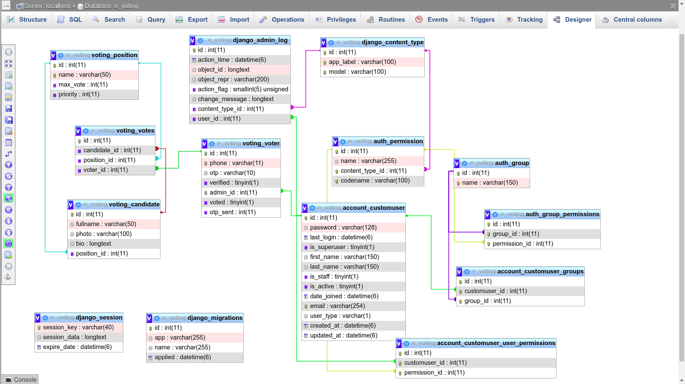

# BallotNest
# BallotNest-using Django
This E - Voting System Was Developed With Django(Python Framework).

This Django-based Voting System web application offers an automated solution for organizations and institutions to streamline their voting processes. Emulating traditional election systems, the platform allows administrators to efficiently manage and populate the system with positions, candidates, and voter lists. By providing an online voting platform, the system significantly reduces the time required for elections and automates the vote counting process. The application features two distinct user interfaces: one for administrators, who manage and oversee the system’s data, and one for voters, who cast their votes and select their preferred candidates. This dual-interface approach ensures a seamless and efficient voting experience.

## Features:

- [x] Vote preview
- [x] Multiple votes
- [x] Result tally via Horizontal Bar Chart
- [x] Print voting results in PDF
- [x] Changeable order of positions to show in the ballot
- [x] CRUD voters
- [x] CRUD candidates
- [x] CRUD positions
- [x] Plugins
- [x] AdminLTE Template

### A. Admin Users Can
1. See Overall Summary Charts of Votes
2. Reset Votes
4. Manage Voters (CRUD)
5. Manage Candidates (CRUD)
6. Manage Positions (CRUD)
7. Change Ballot Style (Ballot Position)
8. Update/Change Ballot Title

### B. Voters Can
1. Register
2. Login
3. Verify with OTP (This can be overwritten in `settings.py` file)
4. Votes for their favourite candidates
5. View candidates they voted for

## 📸 ScreenShots
<figure>
  
  <figcaption>Database Design</figcaption>
</figure>


| Admin| Voter|
|------|-------|
|||
|||
|||
|||
|||
|||
|||
|||
|||
|||
|||
|||
|||
|||
||------- ------ ------ ------|
||------- ------ ------ ------|
||------- ------ ------ ------|
||------- ------ ------ ------|

### Pre-Requisites:
1. Install Git Version Control
[ https://git-scm.com/ ]

2. Install Python Latest Version
[ https://www.python.org/downloads/ ]

3. Install Pip (Package Manager)
[ https://pip.pypa.io/en/stable/installing/ ]

*Alternative to Pip is Homebrew*


### Installation
**1. Create a Folder where you want to save the project**

**2. Create a Virtual Environment and Activate**

Install Virtual Environment First
```
$  pip install virtualenv
```

Create Virtual Environment

For Windows
```
$  python -m venv venv
```
For Mac
```
$  python3 -m venv venv
```
For Linux
```
$  virtualenv .
```

Activate Virtual Environment

For Windows
```
$  source venv/scripts/activate
```

For Mac
```
$  source venv/bin/activate
```

For Linux
```
$  source bin/activate
```

**3. Clone this project**
```
$  git clone https://github.com/jobic10/e-voting-with-django.git
```

Then, Enter the project
```
$  cd e-voting-with-django
```

**4. Install Requirements from 'requirements.txt'**
```python
$  pip3 install -r requirements.txt
```

**5. Run migrations and migrate**
```python manage.py makemigrations```
```python manage.py migrate```

**6. Now Run Server**

Command for PC:
```python
$ python manage.py runserver
```

Command for Mac:
```python
$ python3 manage.py runserver
```

Command for Linux:
```python
$ python3 manage.py runserver
```

**7. Login Credentials**

Create Super User (HOD)
Command for PC:
```
$  python manage.py createsuperuser
```

Command for Mac:
```
$  python3 manage.py createsuperuser
```

Command for Linux:
```
$  python3 manage.py createsuperuser
```


Then Add Email and Password
